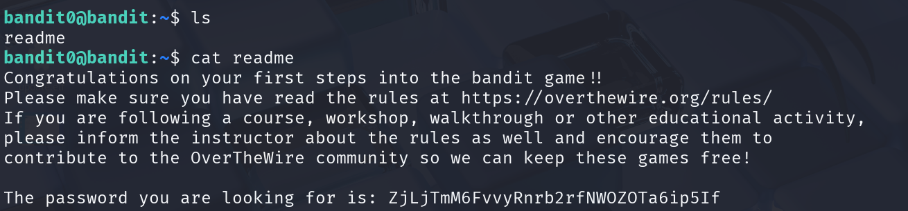

## 🛰️ Bandit Stage 00 ➜ 01

### 🧷 Access Info
**Username:** bandit0  
**Server:** bandit.labs.overthewire.org  
**Port:** 2220  

---

### 🎯 Task Description
Find a readable file in the home directory and extract the password required to log in to the next level.

---

### 🖼️ Terminal Snapshot  


---

### 🧭 Approach Followed
After logging in, a simple directory check reveals a file named **`readme`**.  
Reading this file displays the password needed for Level 01.

---

### 💻 Commands Executed
```bash
ls
cat readme
```

---

### 🔐 Password Retrieved (For Level 01)
**ZjLjTmM6FvvyRnrb2rfNWOZTa6ip5If**

---

### 📘 Understanding the Step
This introductory level teaches the basics:
- Listing files  
- Reading file contents  
- Understanding the structure of Bandit challenges  

---

### 🧠 Key Takeaway
Even simple commands (`ls`, `cat`) are powerful when navigating Linux systems.  
A solid foundation is important before moving to more advanced levels.
