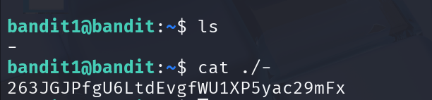

## 🛰️ Bandit Stage 01 ➜ 02

### 🧷 Access Info
**Username:** bandit1  
**Server:** bandit.labs.overthewire.org  
**Port:** 2220  

---

### 🎯 Challenge Overview
A file in the home directory contains the next password, but its **name starts with a dash (`-`)**, which makes it tricky to read using normal commands.

---

### 🖼️ Terminal Snapshot


---

### 🧭 How It Was Solved
Files that begin with `-` are interpreted as command options.  
To safely read such a file, prefix the file name with `./` so it is treated as a **path**, not an option.

---

### 💻 Commands Executed
```bash
ls
cat ./-
```

---

### 🔐 Password Retrieved (For Level 02)
**263JGJPfgU6LtdEvgfWU1XP5yac29mFx**

---

### 📘 Explanation
- The file name is just `-`  
- Running `cat -` would make the shell think you're passing an option, not a file  
- Using `./-` explicitly refers to the file inside the current directory  
- This forces the command to read the file normally  

---

### 🧠 Key Takeaway
Learned how to handle files with **special characters**, especially names starting with dashes.  
Using `./filename` is the safe method for interacting with such files.
