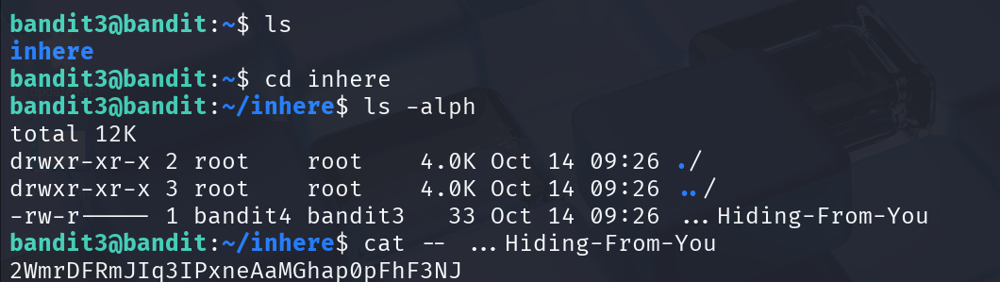

## 🛰️ Bandit Stage 03 ➜ 04

### 🧷 Access Info
**Username:** bandit3  
**Server:** bandit.labs.overthewire.org  
**Port:** 2220  

---

### 🎯 Challenge Overview
The password for the next level is hidden inside a file located within a directory named **`inhere`**.  
The file uses unusual characters and must be read carefully.

---

### 🖼️ Terminal Snapshot


---

### 🧭 How It Was Solved
Inside the `inhere` directory, listing files with `ls -alph` revealed a single readable file.  
Since its filename begins with three dots (`...`), it’s safer to use `--` to prevent the shell from treating it as an option.

---

### 💻 Commands Executed
```bash
ls
cd inhere
ls -alph
cat -- ...Hiding-From-You
```

---

### 🔐 Password Retrieved
**2WmrDFRmJIg3IPxneAaMGhap0pFhF3NJ**

---

### 📘 Explanation
- The directory `inhere` contains only one file  
- The filename starts with `...`, which can confuse the shell  
- Using `cat -- filename` ensures the command treats it strictly as a file  
- Reading the file reveals the password for the next level  

---

### 🧠 Key Takeaway
Learned how to safely read files with **odd or option-like names** using:
- `ls -alph` for full visibility  
- `cat -- filename` to avoid shell misinterpretation  
