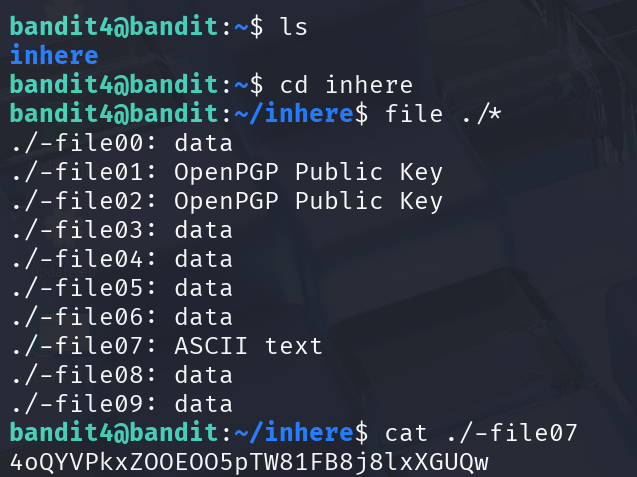

## 🛰️ Bandit Stage 04 ➜ 05

### 🧷 Access Info
**Username:** bandit4  
**Server:** bandit.labs.overthewire.org  
**Port:** 2220  

---

### 🎯 Challenge Overview
Inside the `inhere` directory are multiple files.  
Only **one file** contains **human-readable ASCII text**.  
The goal is to find which one holds the password for the next level.

---

### 🖼️ Terminal Snapshot


---

### 🧭 How It Was Solved
Using the `file` command on all files helps identify their type.  
Most files contain binary data or PGP keys, but **`-file07`** is the only file labeled **ASCII text**, indicating readable content.

---

### 💻 Commands Executed
```bash
ls
cd inhere
file ./*
cat ./-file07
```

---

### 🔐 Password Retrieved
**4oQYVPkxZ0OEOO5pTW81FB8j8lxXGUQw**

---

### 📘 Explanation
- The `inhere` directory contains 10 files named in a hidden style (`-fileXX`)  
- The `file` command reveals the datatype of each file  
- Only `-file07` contains human-readable text  
- `cat` is used to display the contents, revealing the next-level password  

---

### 🧠 Key Takeaway
This level reinforces:
- Identifying readable files using `file`  
- Navigating directories with multiple similar files  
- Understanding that hidden or oddly named files may contain important data  
