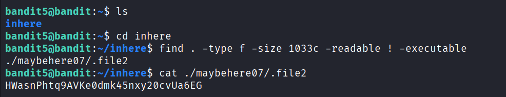

## 🛰️ Bandit Level 05 ➜ 06

### 🧷 Access Info
**Username:** bandit5  
**Password:** Obtained from previous level  
**Server:** bandit.labs.overthewire.org  
**Port:** 2220  

---

### 🎯 Challenge Overview
Inside the `inhere` directory are many nested subdirectories containing numerous files.  
Only one file satisfies all of the following conditions:
- Human-readable  
- Exactly 1033 bytes in size  
- Not executable  

The objective is to locate this file and retrieve the password for the next level.

---

### 🖼️ Terminal Snapshot

---

### 🧭 How It Was Solved
The `inhere` directory contains many subfolders, making manual inspection inefficient.  
A recursive search is performed using the `find` command with filters for file type, size, readability, and execution permissions.  
This approach isolates the exact file that matches all the required conditions.

---

### 💻 Commands Executed
- `ls`  
- `cd inhere`  
- `find . -type f -size 1033c -readable ! -executable`  
- `cat ./maybehere07/.file2`  

---

### 🔐 Password Retrieved
**HWasnPhtq9AVKe0dmk45nxy20cvUa6EG**

---

### 📘 Explanation
- `ls` lists the contents of the current directory.  
- `cd inhere` navigates into the directory containing multiple subdirectories.  
- `find` searches recursively and applies filters to match the exact file requirements.  
- The matching file is identified as a hidden file within a subdirectory.  
- `cat` displays the contents of the file, revealing the password for Level 06.

---

### 🧠 Key Takeaway
- Recursive file searching using `find`  
- Filtering files by size and permissions  
- Working with hidden files in Linux  
- Efficient command-line investigation techniques  
