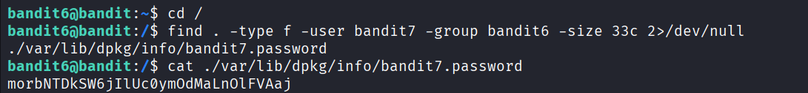

## 🛰️ Bandit Level 06 ➜ 07

### 🧷 Access Info
**Username:** bandit6  
**Password:** Obtained from previous level  
**Server:** bandit.labs.overthewire.org  
**Port:** 2220  

---

### 🎯 Challenge Overview
The password for the next level is stored **somewhere on the server**.  
The correct file must meet all of the following conditions:
- Owned by user **bandit7**
- Owned by group **bandit6**
- Exactly **33 bytes** in size  

The objective is to locate this file and read its contents.

---

### 🖼️ Terminal Snapshot

---

### 🧭 How It Was Solved
Since the file can exist anywhere on the system, the search must start from the root directory.  
The `find` command is used with filters for file owner, group, and size.  
Permission-denied errors are suppressed to keep the output clean.  
Once the correct file is identified, its contents are displayed to retrieve the password.

---

### 💻 Commands Executed
- `cd /`  
- `find . -type f -user bandit7 -group bandit6 -size 33c 2>/dev/null`  
- `cat ./var/lib/dpkg/info/bandit7.password`  

---

### 🔐 Password Retrieved
**morbNTDkSW6jILUOYmdoMaLNOIFVAaj**

---

### 📘 Explanation
- `cd /` moves to the root directory to search the entire filesystem.  
- `find` searches for regular files owned by user `bandit7` and group `bandit6`.  
- `-size 33c` filters files that are exactly 33 bytes in size.  
- `2>/dev/null` hides permission-denied errors during the search.  
- The matching file is located in the system directory and read using `cat`, revealing the password for Level 07.

---

### 🧠 Key Takeaway
- Searching the entire filesystem using `find`  
- Filtering files by owner, group, and size  
- Handling permission errors with output redirection  
- Understanding Linux file ownership and permissions  
