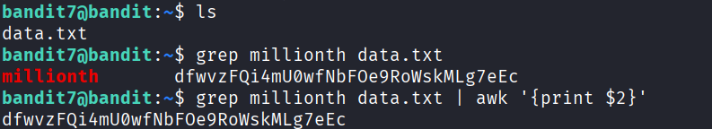

## 🛰️ Bandit Level 07 ➜ 08

### 🧷 Access Info
**Username:** bandit7  
**Password:** Obtained from previous level  
**Server:** bandit.labs.overthewire.org  
**Port:** 2220  

---

### 🎯 Challenge Overview
The password for the next level is stored inside the file `data.txt`.  
The file contains many lines of text, but only one line contains the keyword **`millionth`**.  
The objective is to extract the password associated with that keyword.

---

### 🖼️ Terminal Snapshot

---

### 🧭 How It Was Solved
The directory contents are checked to identify available files.  
The `grep` command is used to search for the line containing the word `millionth`.  
Since the password appears as the second field on that line, `awk` is used to extract only the password value.

---

### 💻 Commands Executed
- `ls`  
- `grep millionth data.txt`  
- `grep millionth data.txt | awk '{print $2}'`  

---

### 🔐 Password Retrieved
**dfwvzFQi4mU0wfNbFOe9RoWskMLg7eEc**

---

### 📘 Explanation
- `ls` lists the files in the current directory and reveals `data.txt`.  
- `grep millionth data.txt` searches for the line containing the keyword `millionth`.  
- The output line contains two fields: the keyword and the password.  
- `awk '{print $2}'` extracts only the second field, which is the password for Level 08.

---

### 🧠 Key Takeaway
- Searching text using `grep`  
- Piping command output between tools  
- Extracting specific fields using `awk`  
- Efficiently handling large text files in Linux  
