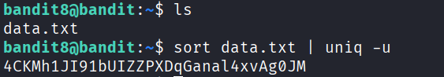

## 🛰️ Bandit Level 08 ➜ 09

### 🧷 Access Info
**Username:** bandit8  
**Password:** Obtained from previous level  
**Server:** bandit.labs.overthewire.org  
**Port:** 2220  

---

### 🎯 Challenge Overview
The password for the next level is stored in the file `data.txt`.  
The file contains many duplicated lines, but **only one line occurs exactly once**.  
The objective is to identify this unique line and retrieve the password.

---

### 🖼️ Terminal Snapshot

---

### 🧭 How It Was Solved
The contents of the directory are first listed to confirm the presence of `data.txt`.  
Since the file contains repeated lines, the data is sorted and then filtered to display only the line that appears once.  
This approach efficiently isolates the unique password.

---

### 💻 Commands Executed
- `ls`  
- `sort data.txt | uniq -u`  

---

### 🔐 Password Retrieved
**4CKMh1JI91bUIZZPXDQGanaL4xvAg0JM**

---

### 📘 Explanation
- `ls` confirms the existence of `data.txt` in the directory.  
- `sort data.txt` arranges all lines in alphabetical order, grouping duplicates together.  
- `uniq -u` filters the sorted output and displays only lines that appear exactly once.  
- The resulting line is the password required to access Level 09.

---

### 🧠 Key Takeaway
- Sorting data using `sort`  
- Identifying unique entries with `uniq -u`  
- Using command pipelines to process text efficiently  
- Handling large datasets with basic Linux utilities  
