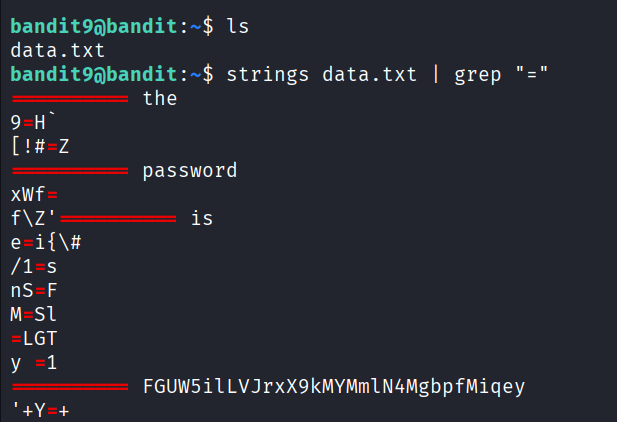

## 🛰️ Bandit Level 09 ➜ 10

### 🧷 Access Info
**Username:** bandit9  
**Password:** Obtained from previous level  
**Server:** bandit.labs.overthewire.org  
**Port:** 2220  

---

### 🎯 Challenge Overview
The password for the next level is stored inside the file `data.txt`.  
The file contains mostly non-human-readable data, but the password is embedded as a readable string.  
The objective is to extract readable strings that contain the `=` character and identify the password.

---

### 🖼️ Terminal Snapshot

---

### 🧭 How It Was Solved
The directory is checked to confirm the presence of `data.txt`.  
Since the file is not entirely readable, the `strings` command is used to extract human-readable text.  
The output is then filtered using `grep` to display only lines containing the `=` character, which helps isolate the password.

---

### 💻 Commands Executed
- `ls`  
- `strings data.txt | grep "="`  

---

### 🔐 Password Retrieved
**FGUW5ilLVJrxX9kMYMmN4MgbpfMiqey**

---

### 📘 Explanation
- `ls` confirms that `data.txt` exists in the current directory.  
- `strings data.txt` extracts readable character sequences from a binary or non-readable file.  
- `grep "="` filters the output to show only lines containing the equals sign.  
- Among the filtered output, the actual password is clearly visible and used to access Level 10.

---

### 🧠 Key Takeaway
- Extracting readable data from non-text files using `strings`  
- Filtering command output with `grep`  
- Handling binary or mixed-content files in Linux  
- Combining commands using pipes for efficient analysis  
