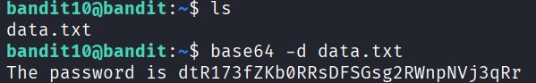

## 🛰️ Bandit Level 10 ➜ 11

### 🧷 Access Info
**Username:** bandit10  
**Password:** Obtained from previous level  
**Server:** bandit.labs.overthewire.org  
**Port:** 2220  

---

### 🎯 Challenge Overview
The password for the next level is stored in the file `data.txt`.  
The content of the file is **Base64 encoded**, meaning it is not directly readable.  
The objective is to decode the file and extract the hidden password.

---

### 🖼️ Terminal Snapshot

---

### 🧭 How It Was Solved
The directory contents are checked to confirm the presence of `data.txt`.  
Since the file content is encoded using Base64, the `base64` utility is used with the decode option to convert it back to readable text.  
The decoded output reveals the password for the next level.

---

### 💻 Commands Executed
- `ls`  
- `base64 -d data.txt`  

---

### 🔐 Password Retrieved
**dtR173fZKb0RRsDFSGsg2RWnpNVj3qRr**

---

### 📘 Explanation
- `ls` lists the files in the directory and confirms `data.txt` exists.  
- `base64 -d data.txt` decodes the Base64-encoded content of the file.  
- The decoded output directly displays the password required to access Level 11.

---

### 🧠 Key Takeaway
- Understanding Base64 encoding and decoding  
- Using `base64` command-line utility  
- Handling encoded data in Linux  
- Extracting hidden information from encoded files  
