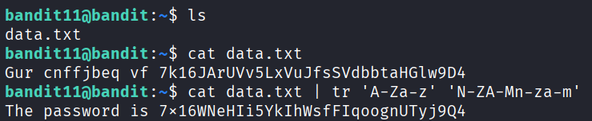

## 🛰️ Bandit Level 11 ➜ 12

### 🧷 Access Info
**Username:** bandit11  
**Password:** Obtained from previous level  
**Server:** bandit.labs.overthewire.org  
**Port:** 2220  

---

### 🎯 Challenge Overview
The password for the next level is stored in the file `data.txt`.  
The content of the file is encoded using **ROT13**, a simple letter substitution cipher.  
The objective is to decode the file and retrieve the actual password.

---

### 🖼️ Terminal Snapshot

---

### 🧭 How It Was Solved
The directory contents are checked to confirm the presence of `data.txt`.  
Viewing the file shows unreadable text, indicating it is encoded.  
The `tr` command is used to translate characters from the ROT13 format back to readable text.  
Once decoded, the password is clearly displayed.

---

### 💻 Commands Executed
- `ls`  
- `cat data.txt`  
- `cat data.txt | tr 'A-Za-z' 'N-ZA-Mn-za-m'`  

---

### 🔐 Password Retrieved
**7x16WNeHIi5YkIhWsfFIqoognUTyj9Q4**

---

### 📘 Explanation
- `ls` confirms that `data.txt` exists in the current directory.  
- `cat data.txt` displays the encoded content.  
- The `tr` command performs character translation, reversing the ROT13 encoding.  
- The decoded output reveals the password required to access Level 12.

---

### 🧠 Key Takeaway
- Understanding ROT13 encoding  
- Using `tr` for character translation  
- Decoding obfuscated text in Linux  
- Combining commands to transform file content efficiently  
