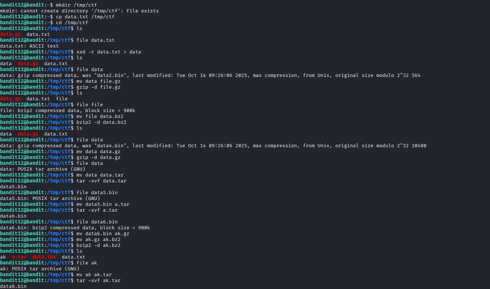
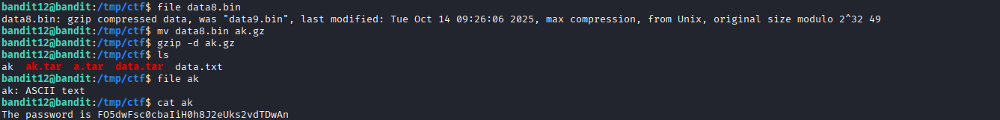

## 🛰️ Bandit Level 12 ➜ 13

### 🧷 Access Info
**Username:** bandit12  
**Password:** Obtained from previous level  
**Server:** bandit.labs.overthewire.org  
**Port:** 2220  

---

### 🎯 Challenge Overview
The password for the next level is stored in the file `data.txt`.  
The file is layered with multiple encodings and compressions (hex, gzip, bzip2, tar).  
The objective is to identify each format step by step and extract the contents until a readable password is revealed.

---

### 🖼️ Terminal Snapshot
  

---

### 🧭 How It Was Solved
A temporary working directory is used to safely manipulate files.  
At each stage, the file type is identified using the `file` command.  
Based on the detected format, the appropriate decoding or extraction tool is applied.  
This process is repeated multiple times until the final ASCII text file containing the password is obtained.

---

### 💻 Commands Executed
- `mkdir /tmp/ctf`  
- `cp data.txt /tmp/ctf`  
- `cd /tmp/ctf`  
- `file data.txt`  
- `xxd -r data.txt > data`  
- `file data`  
- `mv data data.gz`  
- `gzip -d data.gz`  
- `file data`  
- `mv data data.bz2`  
- `bzip2 -d data.bz2`  
- `file data`  
- `mv data data.tar`  
- `tar -xvf data.tar`  
- `file data5.bin`  
- `mv data5.bin a.tar`  
- `tar -xvf a.tar`  
- `file data6.bin`  
- `mv data6.bin ak.bz2`  
- `bzip2 -d ak.bz2`  
- `file ak`  
- `mv ak ak.tar`  
- `tar -xvf ak.tar`  
- `file data8.bin`  
- `mv data8.bin ak.gz`  
- `gzip -d ak.gz`  
- `file ak`  
- `cat ak`  

---

### 🔐 Password Retrieved
**F05dwFsc0cbaIiH0h8J2euks2vdTDwAn**

---

### 📘 Explanation
The `file` command is repeatedly used to determine the current file format.  
Hex-encoded data is converted back to binary using `xxd -r`.  
Compressed files are decompressed using `gzip` and `bzip2`.  
Archived files are extracted using `tar`.  
After all layers are removed, the final file is readable ASCII text containing the password.

---

### 🧠 Key Takeaway
- Identifying file formats with `file`  
- Handling multi-layer compression and encoding  
- Effective use of extraction tools (`gzip`, `bzip2`, `tar`)  
- Importance of a systematic, step-by-step approach in complex challenges  
