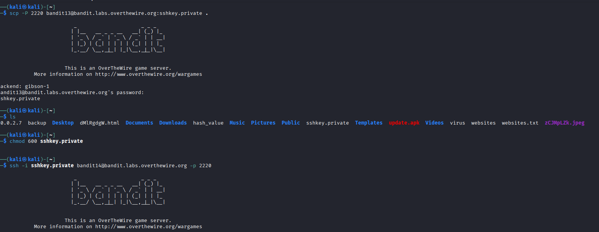
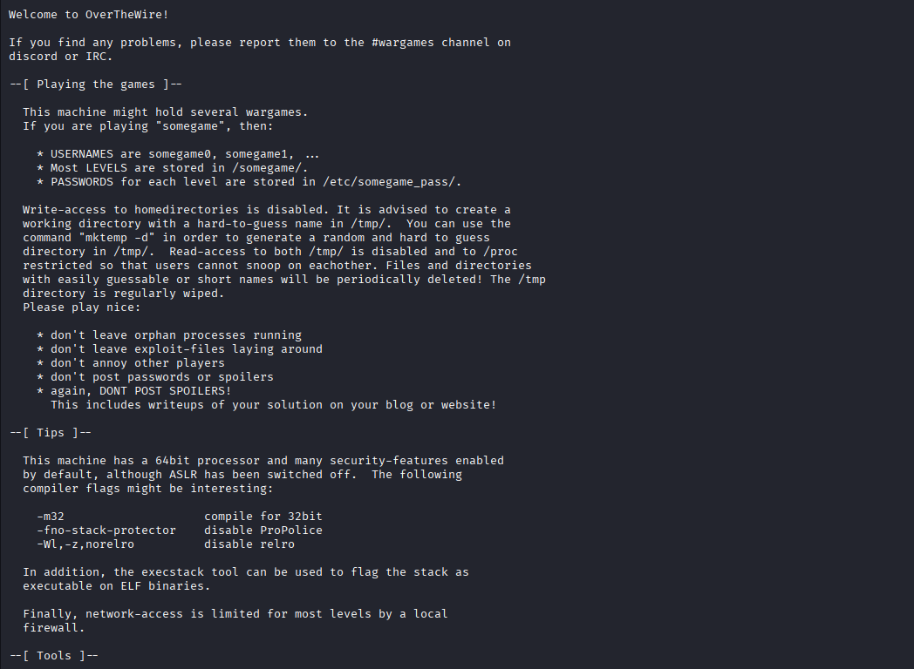
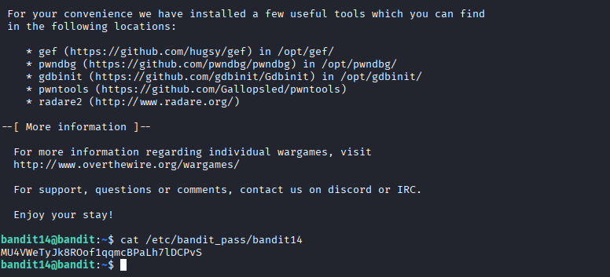

## 🛰️ Bandit Level 13 ➜ 14

### 🧷 Access Info
**Username:** bandit13  
**Password:** Obtained from previous level  
**Server:** bandit.labs.overthewire.org  
**Port:** 2220  

---

### 🎯 Challenge Overview
The password for the next level cannot be accessed using a normal password.  
Instead, an **SSH private key** is provided for authentication.  
The objective is to securely copy the private key to the local machine, set correct permissions, log in using SSH key-based authentication, and retrieve the password for the next level.

---

### 🖼️ Terminal Snapshot
  
  

---

### 🧭 How It Was Solved
The private SSH key is securely copied from the Bandit server to the local system using `scp`.  
File permissions are then restricted to prevent unauthorized access.  
The private key is used to authenticate via SSH without a password.  
Once logged in as the next user, the password file is read to obtain the password for the following level.

---

### 💻 Commands Executed
- `scp -P 2220 bandit13@bandit.labs.overthewire.org:sshkey.private .`  
- `chmod 600 sshkey.private`  
- `ssh -i sshkey.private bandit14@bandit.labs.overthewire.org -p 2220`  
- `cat /etc/bandit_pass/bandit14`  

---

### 🔐 Password Retrieved
**MU4WeTyJk8R0of1qqmcBPaLh7lDCPvS**

---

### 📘 Explanation
The `scp` command securely transfers the private SSH key from the remote server to the local machine.  
The `chmod 600` command ensures the private key has strict permissions, which is required by SSH.  
The `ssh -i` option allows authentication using the private key instead of a password.  
After logging in as the next user, the password file is accessed to retrieve the password for Level 14.

---

### 🧠 Key Takeaway
- Understanding SSH key-based authentication  
- Securely transferring files using `scp`  
- Importance of file permissions for private keys  
- Using SSH keys instead of passwords for secure access  
