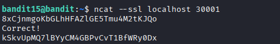

## 🛰️ Bandit Level 15 ➜ 16

### 🧷 Access Info
**Username:** bandit15  
**Password:** Obtained from previous level  
**Server:** bandit.labs.overthewire.org  
**Port:** 2220  

---

### 🎯 Challenge Overview
The password for the next level is retrieved by submitting the current password to a service running on **localhost at port 30001**.  
Unlike the previous level, this service requires an **SSL-encrypted connection**.  
The objective is to connect securely using SSL, send the correct password, and obtain the next-level password.

---

### 🖼️ Terminal Snapshot

---

### 🧭 How It Was Solved
A service listening on port 30001 expects encrypted communication.  
The `ncat` utility with the `--ssl` option is used to establish a secure connection.  
After connecting, the current password is entered.  
Once verified, the service responds with the password for the next level.

---

### 💻 Commands Executed
- `ncat --ssl localhost 30001`  

---

### 🔐 Password Retrieved
**kSkvUpMQ7LBycM4GBPvCvT1BfWRy0Dx**

---

### 📘 Explanation
- `ncat` is an enhanced version of `netcat` that supports SSL connections.  
- The `--ssl` flag ensures encrypted communication with the service.  
- Connecting to `localhost 30001` opens a secure session.  
- The current password is provided as input.  
- Upon successful validation, the service returns the password for Level 16.

---

### 🧠 Key Takeaway
- Using SSL-enabled connections with `ncat`  
- Understanding encrypted network communication  
- Interacting securely with local services  
- Differentiating between plain-text and SSL-based services  
