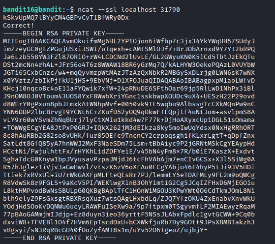
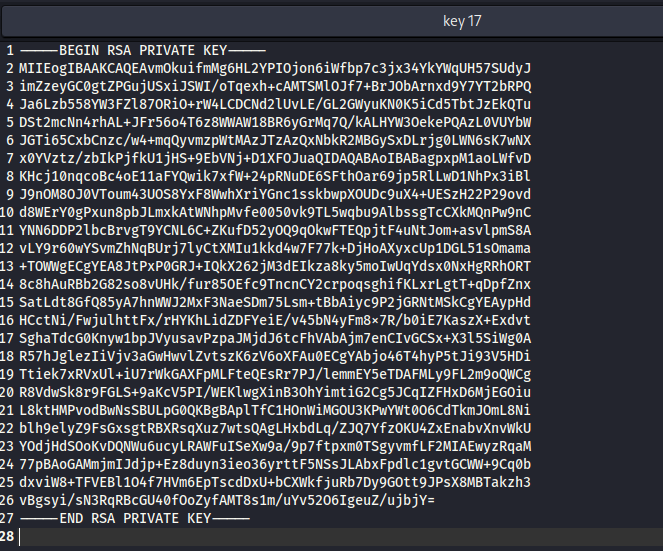
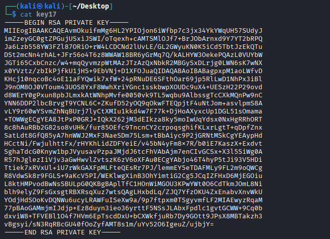

## 🛰️ Bandit Level 16 ➜ 17

### 🧷 Access Info
**Username:** bandit16  
**Password:** Obtained from previous level  
**Server:** bandit.labs.overthewire.org  
**Port:** 2220  

---

### 🎯 Challenge Overview
The password for the next level is obtained by connecting to a **secure SSL service** running on one of several ports.  
Among the available ports, only one provides a valid **RSA private key** after submitting the correct password.  
The objective is to retrieve this private key, use it for SSH authentication, and then read the password for the next level.

---

### 🖼️ Terminal Snapshots
  
  
  

---

### 🧭 How It Was Solved
A secure SSL connection is made to the correct local port using `ncat`.  
After submitting the current level’s password, the service responds with an RSA private key.  
This key is saved to a file and its permissions are restricted.  
The private key is then used to authenticate via SSH as the next user.  
Once logged in, the password file is accessed to retrieve the password for the following level.

---

### 💻 Commands Executed
- `ncat --ssl localhost 31790`  
- *(Save the RSA private key to a file)*  
- `chmod 600 key17`  
- `ssh -i key17 bandit17@bandit.labs.overthewire.org -p 2220`  
- `cat /etc/bandit_pass/bandit17`  

---

### 🔐 Password Retrieved
**EREvavePLFHtFlEsjn3hyzmlvSuSAcRD**

---

### 📘 Explanation
- `ncat --ssl` is used to securely connect to the service providing encrypted communication.  
- Upon successful authentication, the service returns an RSA private key.  
- Proper permissions are required on private keys for SSH to accept them.  
- SSH key-based authentication allows access without a password.  
- The password for Level 17 is stored in `/etc/bandit_pass/bandit17` and can be read once logged in.

---

### 🧠 Key Takeaway
- Using SSL connections with `ncat`  
- Handling and securing RSA private keys  
- SSH authentication using private keys  
- Combining networking and authentication concepts in Linux  
