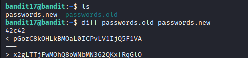

## 🛰️ Bandit Level 17 ➜ 18

### 🧷 Access Info
Username: bandit17  
Password: Obtained from previous level  
Server: bandit.labs.overthewire.org  
Port: 2220  

---

### 🎯 Challenge Overview
The home directory contains two files: `passwords.new` and `passwords.old`.  
Both files are almost identical, but **one line is different**.  
The task is to compare the two files and identify the correct password from the difference.

---

### 🖼️ Terminal Snapshot

---

### 🧭 How It Was Solved
The two files were compared using the `diff` command.  
When running `diff passwords.new passwords.old`, the output shows:
- Lines starting with `<` belong to `passwords.new`
- Lines starting with `>` belong to `passwords.old`

In this case, the **valid password is the line starting with `<`**, which appears as the **first entry** in the diff output.

---

### 💻 Commands Executed
ls  
diff passwords.new passwords.old  

---

### 🔐 Password Retrieved
x2gLTTjFwMOhQ8oWNbMN362QKxfRqGlO

---

### 📘 Explanation
The `ls` command confirms both password files exist.  
The `diff` command compares the files line by line and highlights the difference.  
The line prefixed with `<` represents the content from `passwords.new`.  
This line contains the correct password required to proceed to Bandit Level 18.

---

### 🧠 Key Takeaway
- Comparing files using `diff`  
- Understanding diff symbols (`<` and `>`)  
- Importance of command order while comparing files  
- Carefully identifying the correct value from similar-looking outputs  
