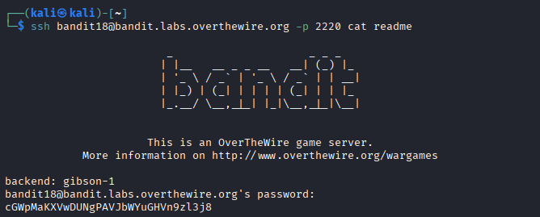

## 🛰️ Bandit Level 18 ➜ 19

### 🧷 Access Info
Username: bandit18  
Password: Obtained from previous level  
Server: bandit.labs.overthewire.org  
Port: 2220  

---

### 🎯 Challenge Overview
The password for the next level is stored in a file named `readme`.  
However, direct login to the Bandit shell is restricted.  
The task is to **execute a command remotely during SSH login** to read the file and obtain the password.

---

### 🖼️ Terminal Snapshot

---

### 🧭 How It Was Solved
Instead of logging into an interactive shell, a command is executed directly while establishing the SSH connection.  
The `cat readme` command is appended to the SSH login command, allowing the file contents to be displayed immediately after authentication.

---

### 💻 Commands Executed
ssh bandit18@bandit.labs.overthewire.org -p 2220 cat readme  

---

### 🔐 Password Retrieved
cGWpMaKXVwDUNgPAVJbWYuGHVn9zl3j8

---

### 📘 Explanation
Normally, logging in as `bandit18` disconnects the session immediately.  
By supplying a command directly to SSH, the command is executed before the session ends.  
The `cat readme` command prints the contents of the file, revealing the password for Level 19.

---

### 🧠 Key Takeaway
- Executing remote commands via SSH  
- Bypassing restricted interactive shells  
- Understanding SSH command execution behavior  
- Reading files without full shell access  
