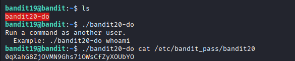

## 🛰️ Bandit Level 19 ➜ 20

### 🧷 Access Info
Username: bandit19  
Password: Obtained from previous level  
Server: bandit.labs.overthewire.org  
Port: 2220  

---

### 🎯 Challenge Overview
A special executable file named `bandit20-do` is present in the home directory.  
This binary allows commands to be executed **as another user**.  
The objective is to use this binary to execute a command as **bandit20** and read the password file for the next level.

---

### 🖼️ Terminal Snapshot

---

### 🧭 How It Was Solved
The home directory is listed to identify available files.  
The `bandit20-do` binary is executed with a command as its argument.  
By passing the `cat` command along with the path to the password file, the binary runs the command as user `bandit20` and reveals the password.

---

### 💻 Commands Executed
ls  
./bandit20-do  
./bandit20-do cat /etc/bandit_pass/bandit20  

---

### 🔐 Password Retrieved
0qXahG8ZjOVMN9Ghs7iOWsCfZyXOUbYO

---

### 📘 Explanation
The `bandit20-do` file is a setuid binary that allows execution of commands as another user.  
Running it without arguments shows usage instructions.  
When executed with `cat /etc/bandit_pass/bandit20`, the command runs with `bandit20` privileges.  
This provides access to the password file, which is normally restricted.

---

### 🧠 Key Takeaway
- Understanding setuid binaries  
- Executing commands as another user  
- Basic privilege escalation concepts  
- Safely handling executable permissions  
