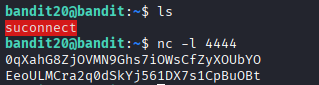
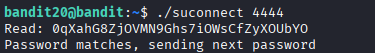

## 🛰️ Bandit Level 20 ➜ 21

### 🧷 Access Info
Username: bandit20  
Password: Obtained from previous level  
Server: bandit.labs.overthewire.org  
Port: 2220  

---

### 🎯 Challenge Overview
A binary named `suconnect` is present in the home directory.  
This program connects to a service running on a specific port and verifies the password.  
The task is to create a listening service, send the current password through it, and allow `suconnect` to validate it in order to receive the next-level password.

---

### 🖼️ Terminal Snapshot
  

---

### 🧭 How It Was Solved
A local listener is created using `nc` (netcat) on port `4444`.  
The current level’s password is sent through this listener.  
In another terminal, the `suconnect` binary is executed with the same port number.  
The binary connects to the listener, verifies the password, and returns the password for the next level.

---

### 💻 Commands Executed
nc -l 4444  
./suconnect 4444  

---

### 🔐 Password Retrieved
EeoULMCra2q0dSkYj561DX7s1CpBuOBt

---

### 📘 Explanation
The `nc -l 4444` command starts a listener on port 4444.  
The password for the current level is sent through this listener.  
The `suconnect` binary connects to the listening port and checks whether the password matches.  
Once validated, the program outputs the password for Bandit Level 21.

---

### 🧠 Key Takeaway
- Using `netcat` to create listening services  
- Understanding client–server communication on localhost  
- Interacting with custom binaries  
- Coordinating multiple terminals for network-based challenges  
