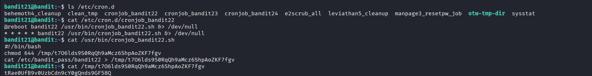

## 🛰️ Bandit Level 21 ➜ 22

### 🧷 Access Info
Username: bandit21  
Password: Obtained from previous level  
Server: bandit.labs.overthewire.org  
Port: 2220  

### 🎯 Challenge Overview
The password for the next level is not stored directly in the home directory.  
Instead, it is handled by a cron job that runs automatically on the system.  
The objective is to inspect the cron configuration, analyze the script being executed, and locate where the password is written.

### 🖼️ Terminal Snapshot

### 🧭 How It Was Solved
The cron jobs directory is inspected to identify Bandit-related scheduled tasks.  
The cron configuration for bandit22 reveals a script that executes at regular intervals.  
Inspecting this script shows that it copies the password into a temporary file inside the /tmp directory.  
Reading this temporary file reveals the password for the next level.

### 💻 Commands Executed
ls /etc/cron.d  
cat /etc/cron.d/cronjob_bandit22  
cat /usr/bin/cronjob_bandit22.sh  
cat /tmp/t70GldS9s0RqQh9aMcz6ShpAoZKF7fgv  

### 🔐 Password Retrieved
tRae0UfB9v0UzbCdn9cY0gQnds9GF58Q

### 📘 Explanation
The /etc/cron.d directory contains system-wide cron job definitions.  
The cronjob_bandit22 file shows a job executed periodically as user bandit22.  
The associated script copies the password from /etc/bandit_pass/bandit22 into a readable file inside /tmp.  
Because this temporary file has read permissions, the password can be accessed directly.

### 🧠 Key Takeaway
Cron jobs can automate tasks without user interaction.  
Inspecting cron configurations can reveal sensitive operations.  
Temporary directories may expose confidential data if not handled securely.  
Understanding scheduled tasks is essential for Linux security analysis.
