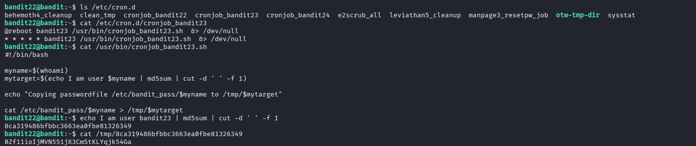

## 🛰️ Bandit Level 22 ➜ 23

### 🧷 Access Info
Username: bandit22  
Password: Obtained from previous level  
Server: bandit.labs.overthewire.org  
Port: 2220  

### 🎯 Challenge Overview
The password for the next level is handled by a cron job executed as user **bandit23**.  
Instead of directly storing the password in a predictable file, the cron job dynamically creates a filename using an MD5 hash of the username.  
The goal is to understand the cron script logic, recreate the filename, and read the password from the generated file in `/tmp`.

### 🖼️ Terminal Snapshot

### 🧭 How It Was Solved
The cron jobs directory is inspected to locate jobs related to Bandit levels.  
The cron configuration for `bandit23` reveals a script executed periodically.  
Reading the script shows that it:
- Determines the current username
- Generates an MD5 hash based on the string `I am user <username>`
- Copies the password file into `/tmp` using the generated hash as the filename  

By manually recreating the MD5 hash for `bandit23`, the exact filename is discovered.  
Reading this file reveals the password for the next level.

### 💻 Commands Executed
ls /etc/cron.d  
cat /etc/cron.d/cronjob_bandit23  
cat /usr/bin/cronjob_bandit23.sh  
echo I am user bandit23 | md5sum | cut -d ' ' -f 1  
cat /tmp/8ca319486bfbc3663ea0fbe81326349  

### 🔐 Password Retrieved
0Zf11ioIjMVN551jX3CmStKLYqjk54Ga

### 📘 Explanation
The cron job runs `/usr/bin/cronjob_bandit23.sh` as user `bandit23`.  
The script hashes the string `I am user bandit23` to generate a unique filename.  
It then copies the password from `/etc/bandit_pass/bandit23` into `/tmp/<md5hash>`.  
By reproducing the same hash manually, the correct file can be identified and read.

### 🧠 Key Takeaway
Cron jobs may use dynamic logic to hide sensitive data.  
Understanding shell scripts is crucial to reversing automated behavior.  
Hashes can be predictable if the input is known.  
Analyzing scheduled tasks is a powerful technique in Linux security challenges.
