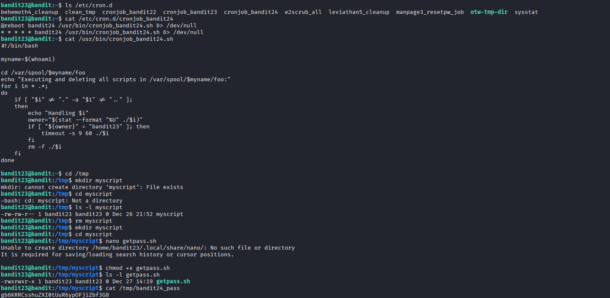

## 🛰️ Bandit Level 23 ➜ 24

### 🧷 Access Info
Username: bandit23  
Password: Obtained from previous level  
Server: bandit.labs.overthewire.org  
Port: 2220  

### 🎯 Challenge Overview
The password for the next level is managed by a **cron job** that executes scripts found in a specific directory.  
The cron job runs as user **bandit24** and executes any script owned by **bandit23** placed inside `/var/spool/bandit24/foo`.  
The objective is to place a malicious script in this directory that reads the password file and saves it in a readable location before the cron job deletes it.

### 🖼️ Terminal Snapshot

### 🧭 How It Was Solved
The cron configuration for `bandit24` is inspected to understand its behavior.  
The cron script checks `/var/spool/bandit24/foo` and executes scripts owned by `bandit23`.  
A custom script is created inside `/tmp`, then moved into the cron directory.  
This script copies the password from `/etc/bandit_pass/bandit24` into a temporary readable file.  
After the cron job runs, the temporary file is read to obtain the password.

### 💻 Commands Executed
ls /etc/cron.d  
cat /etc/cron.d/cronjob_bandit24  
cat /usr/bin/cronjob_bandit24.sh  
cd /tmp  
rm myscript  
mkdir myscript  
cd myscript  
nano getpass.sh  
chmod +x getpass.sh  
cat /tmp/bandit24_pass  

### 🔐 Password Retrieved
gb8KRRCsshuZXI0tUuR6ypOFjiZbf3G8

### 📘 Explanation
The cron job automatically executes scripts placed in `/var/spool/bandit24/foo` that are owned by `bandit23`.  
By crafting a script that copies the password file to a temporary location, the cron job unknowingly exposes the password.  
Once the cron job finishes execution, the copied password file remains readable and can be accessed manually.

### 🧠 Key Takeaway
Cron jobs can be abused if they execute user-controlled scripts.  
Understanding ownership and permission checks is critical for exploiting automated tasks.  
Temporary directories can be leveraged to exfiltrate sensitive data.  
Analyzing cron scripts is a powerful technique in Linux privilege escalation challenges.
