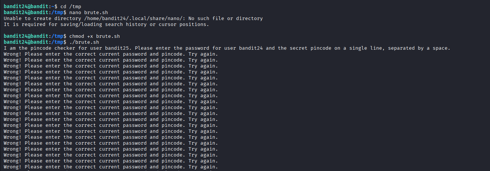
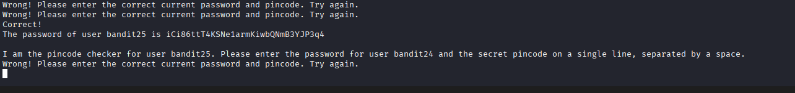

## 🛰️ Bandit Level 24 ➜ 25

### 🧷 Access Info
Username: bandit24  
Password: Obtained from previous level  
Server: bandit.labs.overthewire.org  
Port: 2220  

### 🎯 Challenge Overview
A program is provided that verifies a **secret numeric PIN** together with the current user’s password.  
The correct PIN is unknown and must be discovered.  
The goal is to **brute-force the PIN** by repeatedly submitting the correct password along with different PIN values until the program returns the password for the next level.

### 🖼️ Terminal Snapshots
  

### 🧭 How It Was Solved
The pin-checking program expects two inputs on a single line:
1. The current password for `bandit24`
2. A numeric PIN  

Manually guessing the PIN is impractical.  
A brute-force shell script is created to automatically try all possible PIN values by combining each PIN with the correct password.  
The script runs until the program confirms a valid combination and prints the password for the next level.

### 💻 Commands Executed
cd /tmp  
nano brute.sh  
chmod +x brute.sh  
./brute.sh  

### 🔐 Password Retrieved
iCi86ttT4KSNe1armKiwbQNmB3YJP3q4

### 📘 Explanation
The checker program validates both the password and the PIN together.  
Because there is no rate limiting, the program allows unlimited attempts.  
Automating the process with a shell script makes it possible to test all PIN values quickly.  
Once the correct PIN is found, the program outputs the password for Bandit Level 25.

### 🧠 Key Takeaway
Brute-force attacks can be automated using simple shell scripts.  
PIN-based authentication is weak without rate limiting or lockout mechanisms.  
Automation is essential for solving repetitive security challenges efficiently.  
Understanding how programs process input is critical in exploitation scenarios.
