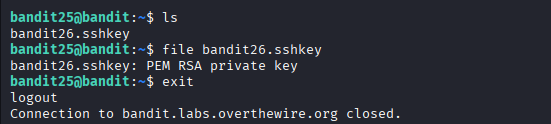
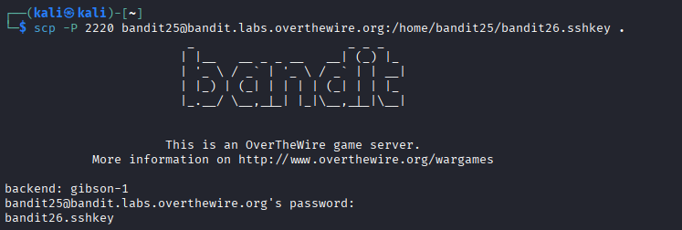
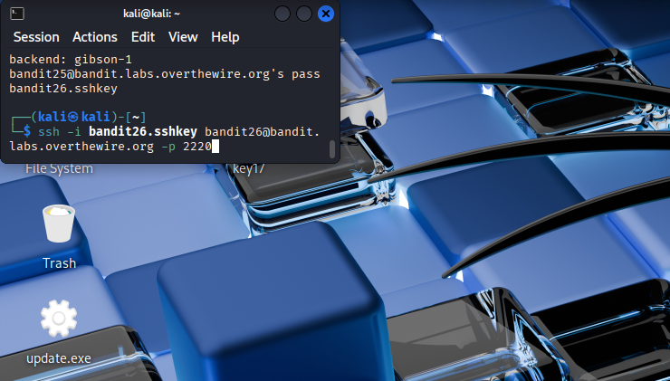
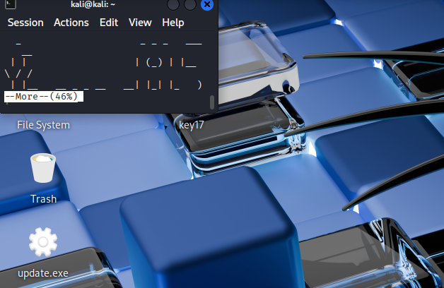

## 🛰️ Bandit Level 25 ➜ 26

### 🧷 Access Info
Username: bandit25  
Password: Obtained from previous level  
Server: bandit.labs.overthewire.org  
Port: 2220  

### 🎯 Challenge Overview
The home directory contains an SSH private key file for the next level user (`bandit26.sshkey`).  
Direct SSH login using this key drops the user into a restricted environment where commands cannot be executed normally.  
The objective is to **transfer the private key**, log in using SSH key authentication, escape the restricted shell, and read the password file for the next level.

### 🖼️ Terminal Snapshots
  
  
  
  

### 🧭 How It Was Solved
The SSH private key for `bandit26` is identified in the home directory.  
This key is securely copied to the local machine using `scp`.  
SSH is then used with the private key to log in as `bandit26`.  
The session opens in a restricted pager environment (`more`).  
By interacting with the pager and spawning a shell, command execution is regained.  
Once a shell is available, the password file for `bandit26` is read to obtain the password for the next level.

### 💻 Commands Executed
ls  
file bandit26.sshkey  
exit  
scp -P 2220 bandit25@bandit.labs.overthewire.org:/home/bandit25/bandit26.sshkey .  
ssh -i bandit26.sshkey bandit26@bandit.labs.overthewire.org -p 2220  
:set shell=/bin/bash  
:shell  
cat /etc/bandit_pass/bandit26  

### 🔐 Password Retrieved
s0773xxkk0MXfdQfPRVr9L3jJBU0gCZ

### 📘 Explanation
The private SSH key enables key-based authentication for the next user.  
Although login is successful, the environment is intentionally restricted using a pager.  
Pager escape techniques allow spawning a shell from within the restricted interface.  
Once shell access is achieved, standard commands can be executed to read the password file.

### 🧠 Key Takeaway
SSH keys can grant access even when passwords are unavailable.  
Restricted shells can often be escaped if misconfigured.  
Understanding pager behavior (`more`, `less`) is valuable in security challenges.  
Privilege boundaries can be bypassed through environment manipulation when safeguards are weak.
