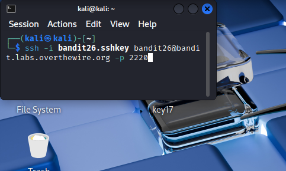
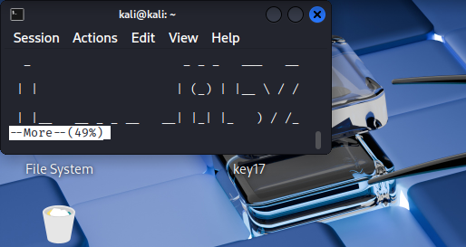
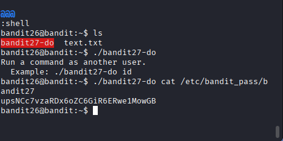

## 🛰️ Bandit Level 26 ➜ 27

### 🧷 Access Info
Username: bandit26  
Password: Obtained from previous level  
Server: bandit.labs.overthewire.org  
Port: 2220  

### 🎯 Challenge Overview
Access to the next level is provided using an SSH private key, but the login session opens inside a **restricted pager environment**.  
Normal command execution is blocked.  
The objective is to escape this restricted environment, identify a helper binary that can run commands as another user, and retrieve the password for the next level.

### 🖼️ Terminal Snapshots
  
  

### 🧭 How It Was Solved
SSH login is performed using the private key for `bandit26`.  
The session opens inside a `more` pager, preventing direct shell usage.  
By interacting with the pager, a shell is spawned to regain command execution.  
Inside the shell, a binary named `bandit27-do` is discovered.  
This binary allows commands to be executed as user `bandit27`.  
Using it to read the password file reveals the password for the next level.

### 💻 Commands Executed
ssh -i bandit26.sshkey bandit26@bandit.labs.overthewire.org -p 2220  
:set shell=/bin/bash  
:shell  
ls  
./bandit27-do  
./bandit27-do cat /etc/bandit_pass/bandit27  

### 🔐 Password Retrieved
upsNCc7vzaRDx6oZC6GiR6ERwe1MowGB

### 📘 Explanation
The SSH private key allows authentication but drops the user into a restricted pager environment.  
Pager escape techniques enable spawning a real shell.  
The `bandit27-do` binary is designed to execute commands as another user.  
By leveraging this binary to read `/etc/bandit_pass/bandit27`, the password for the next level is obtained.

### 🧠 Key Takeaway
Restricted shells and pagers can often be escaped if misconfigured.  
Understanding pager behavior (`more`, `less`) is essential in security challenges.  
Helper binaries that run commands as other users can be leveraged for privilege escalation.  
Combining environment escapes with controlled command execution enables progress through restricted systems.
