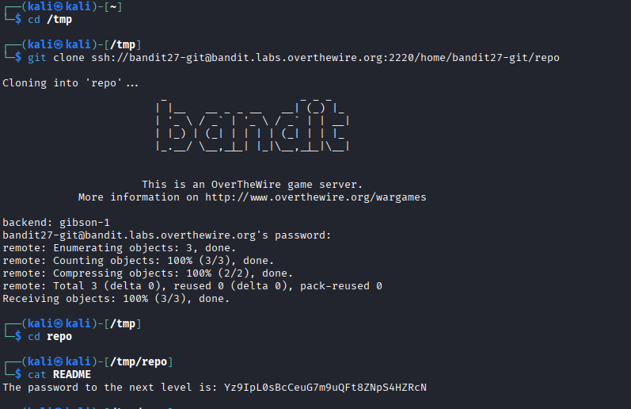

## 🛰️ Bandit Level 27 ➜ 28

### 🧷 Access Info
Username: bandit27  
Password: Obtained from previous level  
Server: bandit.labs.overthewire.org  
Port: 2220  

### 🎯 Challenge Overview
The password for the next level is stored inside a **Git repository** hosted on the Bandit server.  
The objective is to **clone the repository using Git over SSH**, navigate into it, and read the file containing the password.

### 🖼️ Terminal Snapshot

### 🧭 How It Was Solved
A temporary directory is used to avoid clutter.  
The Git repository is cloned from the remote Bandit Git server using SSH authentication.  
After cloning, the repository contents are inspected.  
The `README` file inside the repository contains the password for the next level.

### 💻 Commands Executed
cd /tmp  
git clone ssh://bandit27-git@bandit.labs.overthewire.org:2220/home/bandit27-git/repo  
cd repo  
cat README  

### 🔐 Password Retrieved
Yz9IpL0sBcCeuG7m9uQFt8ZNpS4HZRcN

### 📘 Explanation
The `git clone` command downloads the remote repository to the local system.  
SSH is used for authentication with the Bandit server.  
Once cloned, standard file inspection reveals the password stored in the `README` file.  
This level introduces basic Git usage in a security challenge context.

### 🧠 Key Takeaway
Git repositories can store sensitive information if not handled carefully.  
Understanding Git basics is important in security and CTF challenges.  
Remote repositories can be accessed securely using SSH.  
Always inspect repository contents when performing security assessments.
