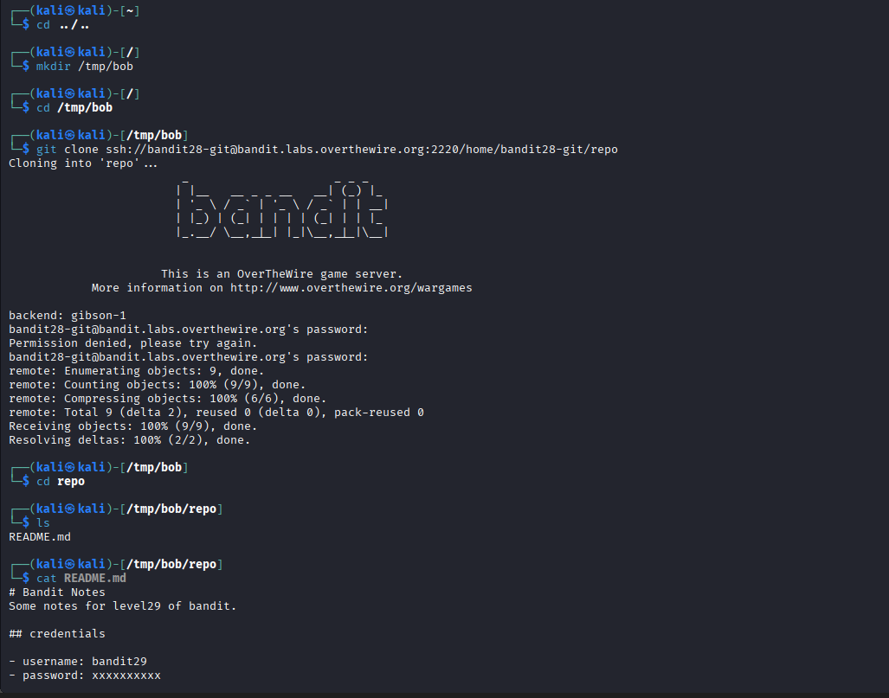
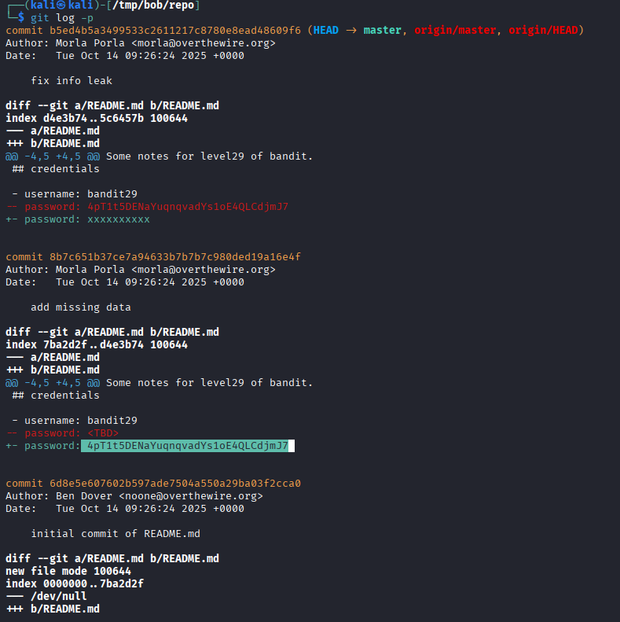

## 🛰️ Bandit Level 28 ➜ 29

### 🧷 Access Info
Username: bandit28  
Password: Obtained from previous level  
Server: bandit.labs.overthewire.org  
Port: 2220  

### 🎯 Challenge Overview
The password for the next level is stored inside a **Git repository**, but it is **not visible in the latest version** of the files.  
The repository history contains commits where sensitive information was previously exposed.  
The objective is to inspect the **Git commit history and diffs** to recover the leaked password.

### 🖼️ Terminal Snapshots
  

### 🧭 How It Was Solved
A temporary directory is created to safely clone the repository.  
The Git repository for `bandit28` is cloned using SSH authentication.  
The `README.md` file initially shows masked credentials.  
By inspecting the commit history using `git log -p`, earlier commits are reviewed.  
One of the previous commits reveals the password before it was removed or replaced.

### 💻 Commands Executed
cd /tmp  
mkdir bob  
cd /tmp/bob  
git clone ssh://bandit28-git@bandit.labs.overthewire.org:2220/home/bandit28-git/repo  
cd repo  
ls  
cat README.md  
git log -p  

### 🔐 Password Retrieved
4pT1t5DENaYuqnqvadYs1oE4QLCdjmJ7

### 📘 Explanation
The latest version of the repository hides the password.  
However, Git preserves full history unless rewritten.  
Using `git log -p` displays patch-level changes for each commit.  
An earlier commit clearly exposes the password for user `bandit29`.  
This demonstrates how sensitive data can persist in version control history even after removal.

### 🧠 Key Takeaway
Git history can leak sensitive information if secrets are committed.  
Removing data from files does not remove it from Git history.  
Always avoid committing credentials to repositories.  
Reviewing commit diffs is a powerful technique in security analysis and CTF challenges.
