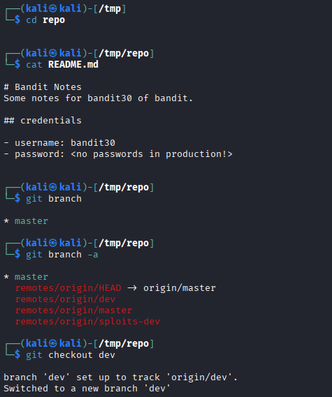
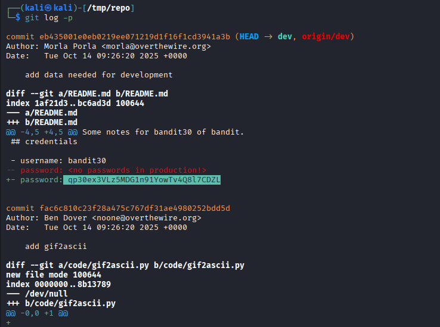

## 🛰️ Bandit Level 29 ➜ 30

### 🧷 Access Info
Username: bandit29  
Password: Obtained from previous level  
Server: bandit.labs.overthewire.org  
Port: 2220  

### 🎯 Challenge Overview
The password for the next level is stored inside a **Git repository**, but it is **not visible in the master branch**.  
The repository contains multiple branches, and sensitive information may exist in a **development branch**.  
The objective is to explore all branches, switch to the correct one, and inspect the commit history to retrieve the password.

### 🖼️ Terminal Snapshots
  

### 🧭 How It Was Solved
The repository is inspected and the `README.md` file on the master branch shows no password.  
All available branches are listed, revealing additional remote branches.  
The `dev` branch is checked out locally.  
After switching to the development branch, the Git commit history is reviewed.  
A previous commit exposes the password that was added during development.

### 💻 Commands Executed
cd /tmp/repo  
cat README.md  
git branch  
git branch -a  
git checkout dev  
git log -p  

### 🔐 Password Retrieved
q93oex3VLz5MDG1n9lYowTv4Q8l7CDZL

### 📘 Explanation
The master branch intentionally hides sensitive information.  
Git repositories can contain multiple branches with different content.  
By switching to the `dev` branch, additional commits become visible.  
Using `git log -p` reveals file changes, including previously committed credentials.  
This demonstrates how secrets can remain exposed in non-default branches.

### 🧠 Key Takeaway
Sensitive data can leak through unused or forgotten Git branches.  
Always review all branches when auditing repositories.  
Git history preserves changes unless explicitly cleaned.  
Understanding branch management is crucial in security and CTF challenges.
