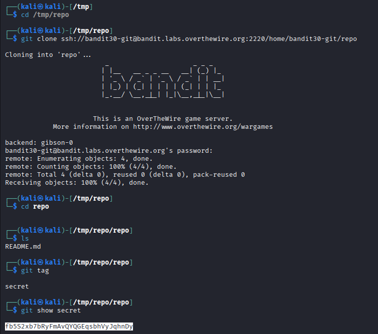

## 🛰️ Bandit Level 30 ➜ 31

### 🧷 Access Info
Username: bandit30  
Password: Obtained from previous level  
Server: bandit.labs.overthewire.org  
Port: 2220  

### 🎯 Challenge Overview
The password for the next level is stored inside a **Git repository**, but it is **not present in files or commit history**.  
Instead, the password is hidden inside a **Git tag**.  
The task is to identify the tag and inspect its contents to retrieve the password.

### 🖼️ Terminal Snapshot

### 🧭 How It Was Solved
The Git repository for `bandit30` is cloned into a temporary directory.  
After navigating into the repository, available Git tags are listed.  
A tag named `secret` is discovered.  
Using `git show` on the tag reveals hidden content that contains the password for the next level.

### 💻 Commands Executed
cd /tmp  
git clone ssh://bandit30-git@bandit.labs.overthewire.org:2220/home/bandit30-git/repo  
cd repo  
ls  
git tag  
git show secret  

### 🔐 Password Retrieved
fb5S2xb7bRyFmAvQYQGEqsbhVyJqhnDy

### 📘 Explanation
Git tags can store messages or reference specific commits.  
Although no password appears in the repository files, the tag contains embedded information.  
The `git show` command displays the data associated with the tag.  
This reveals the password that was intentionally hidden from normal inspection.

### 🧠 Key Takeaway
Sensitive information can be hidden in Git tags, not just files or commits.  
Complete Git audits must include branches, history, and tags.  
Git metadata can expose secrets if repositories are not handled carefully.  
Understanding Git internals is essential for security testing and CTF challenges.
