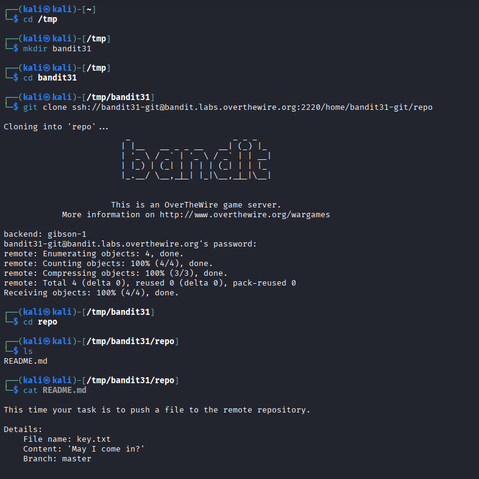
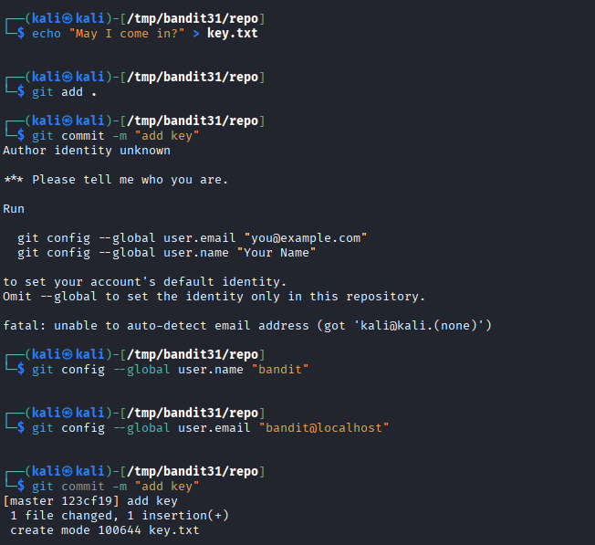
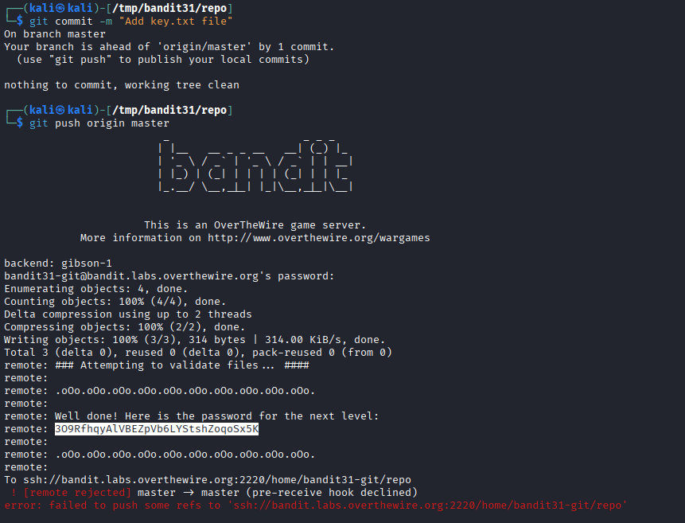

## 🛰️ Bandit Level 31 ➜ 32

### 🧷 Access Info
Username: bandit31  
Password: Obtained from previous level  
Server: bandit.labs.overthewire.org  
Port: 2220  

### 🎯 Challenge Overview
This level requires **interacting with a Git repository by pushing a file** to the remote server.  
Instead of reading data, the task is to **create a specific file with exact content**, commit it, and push it to the remote repository.  
If the file and content are correct, the server validates it and returns the password for the next level.

### 🖼️ Terminal Snapshots
  
  

### 🧭 How It Was Solved
A temporary directory is created to clone the repository safely.  
After cloning, the `README.md` file explains the task requirements:
- File name must be `key.txt`
- File content must be exactly: **May I come in?**
- Branch must be `master`

The file is created with the required content and staged for commit.  
Git initially fails due to missing user identity, so username and email are configured.  
After committing, the changes are pushed to the remote repository.  
The server validates the push and prints the password for the next level.

### 💻 Commands Executed
cd /tmp  
mkdir bandit31  
cd bandit31  
git clone ssh://bandit31-git@bandit.labs.overthewire.org:2220/home/bandit31-git/repo  
cd repo  
ls  
cat README.md  
echo "May I come in?" > key.txt  
git add .  
git config --global user.name "bandit"  
git config --global user.email "bandit@localhost"  
git commit -m "add key"  
git push origin master  

### 🔐 Password Retrieved
309RfhqyALVBEZpvb6LYStshZoqo5sK

### 📘 Explanation
This level demonstrates a **write-based Git challenge** instead of data extraction.  
The server validates pushed content using hooks before accepting it.  
Even though the push is eventually rejected, the server still reveals the password after validation.  
Correct file naming, exact content, and proper Git workflow are crucial for success.

### 🧠 Key Takeaway
Git repositories can enforce rules using server-side hooks.  
Security challenges may require writing data, not just reading it.  
Understanding Git commits, pushes, and configuration is essential.  
Exact formatting and instructions must be followed precisely in automated validations.
