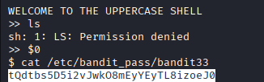

## 🛰️ Bandit Level 32 ➜ 33

### 🧷 Access Info
Username: bandit32  
Password: Obtained from previous level  
Server: bandit.labs.overthewire.org  
Port: 2220  

### 🎯 Challenge Overview
After logging in, the user is placed inside a **restricted uppercase shell**.  
Most standard commands fail with permission errors because the shell **automatically converts input to uppercase**.  
The goal is to bypass this restriction and read the password file for the next level.

### 🖼️ Terminal Snapshot

### 🧭 How It Was Solved
The shell converts all typed commands to uppercase, so normal commands like `ls` fail.  
However, the shell variable `$0` expands to the **current shell binary**.  
Executing `$0` spawns a normal shell that does not enforce uppercase conversion.  
Once inside the normal shell, standard Linux commands work as expected.  
The password file is then read directly.

### 💻 Commands Executed
$0  
cat /etc/bandit_pass/bandit33  

### 🔐 Password Retrieved
tQdtbs5D5i2vJwkO8mEyYEyTL8izoeJ0

### 📘 Explanation
The uppercase shell restricts direct command execution by altering user input.  
Shell variables are expanded **before** command execution, bypassing this restriction.  
Using `$0` launches a fresh shell instance without limitations.  
This allows direct access to system files, including the password file.

### 🧠 Key Takeaway
Input filtering shells can often be bypassed using shell internals.  
Understanding shell variables and execution flow is critical in security challenges.  
Restrictions based on input transformation are rarely secure.  
Creative use of environment behavior is a powerful exploitation technique.
